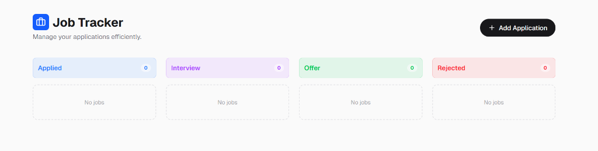

# Job Application Tracker

[](https://vercel.com/new/clone?repository-url=https%3A%2F%2Fgithub.com%2Ftris010%2Fjob-application-tracker)

> **A privacy-focused, local-first Kanban board to track job applications without spreadsheets.**

[](public/screenshot.png)

## 🧩 Problem, Solution, & Outcome

- **Problem:** Managing hundreds of job applications in spreadsheets is tedious, visually unappealing, and makes it hard to track status changes (e.g., Applied → Interview) effectively.
- **Solution:** Engineered a robust **Next.js Web Application** featuring a **Kanban-style interface**. Implemented a custom local storage hook for privacy-first data persistence, ensuring users own their data without complex database setups.
- **Outcome:** Created a zero-latency tracking tool that simplifies the recruitment lifecycle, allowing for instant status updates and visual organization of 50+ applications.

## 🛠️ Tech Stack

- **Framework:** Next.js 14 (App Router)
- **Language:** TypeScript
- **Styling:** Tailwind CSS + CSS Modules
- **Icons:** Lucide React
- **Persistence:** LocalStorage API (Custom Hook)

## 💻 Running Locally

```bash
npm install
npm run dev
# Open http://localhost:3000
```

## 📜 Archives

The legacy Python/SQLite CLI version is preserved in the [legacy/](./legacy) directory.
